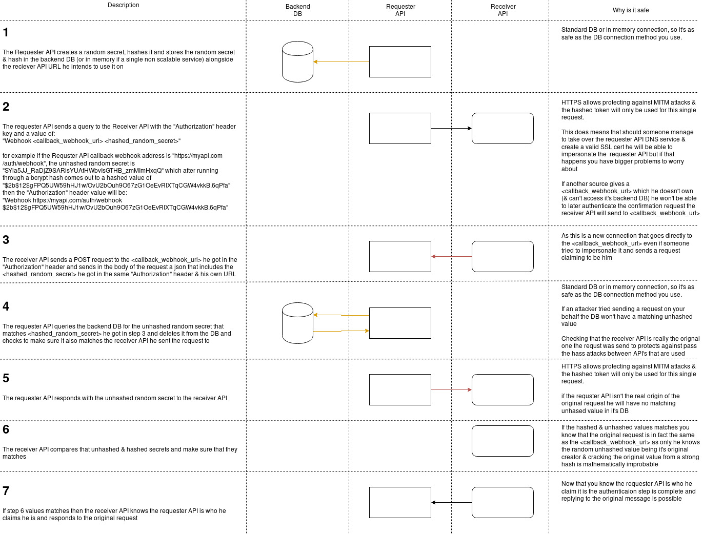

# webhook_auth_poc

## API to API Authentication without the need of any preshared secrets at all!

Python3 based proof of concept for a webhook\callback based authentication which allows any API to know that any other API is in fact who it claim it is without having to configure any preshared secrets between them (it ensures that the URL of the requester is really who he claim it is).

The basic idea is that one can use webhooks as the authentication method provided that the API call uses HTTPS (to guard against MITM attacks) & that the DNS is secure (but if someone manages to hijack your DNS you have bigger problems).

This allows one to connect API's to each other in a secure fashion without having to worry about keeping secrets as every request has a random one use token generated for it in the requester API (the one which sends the request), the requester then hashes the one use token and saves (be it in memory or in a backend DB) the following pieces of information:

* the hashed token
* the unhashed token
* the receiver API (the one that receives the request) URL he's going to send the token to

The hashed token is then sent to the receiver API along with a webhook address which is part of the requester API as part of the `Authorization` header in the format of `Webhook requester_webhook_url hashed_token`, upon receiving the hashed token the receiver API then confirms with the `requester_webhook_url` that it is in fact the one that sent the request by opening a new connection to the `requester_webhook_url` address provided in the `Authorization` header and sending it the `hashed_token` & the url of itself (the receiver url where the request was received at) in the body of a POST request in the following JSON format `{"hash": "hashed_token", "url": "receiver_webhook_url"}`.

The requester API then receives the request to the webhook address and does the following:

1. He checks that the receiver URL he received is the same one as the one it sent the `hashed_token` to - this guards against passing the tokens between multiple API's 
2. He checks that he has an unhashed version of the token () - as tokens are randomly generated it and are only shared once to the receiver API it would be impossible to anyone else to guess them (provided you used HTTPS to guard against MITM)
3. If both of the above are true he responds with the unhashed version of the token and delete it from it's DB\memory (making it in fact a single use token)

The receiver API then checks that the unhashed version does in fact matches the hashed version by running it through the hashing algorithm & if both are true he knows that the original request does in fact came from the API that's in control of the webhook (being the original creator of the random token and using modern hashing functions no one else can make that link in a reasonable time frame).

Attached below is a diagram of the workflow between all components:

## POC specific info

The following envvars are used to control the POC:

* ENV - if set to "dev" will use the builtin flask webserver
* REDIS_HOST - the hostname for the redis that is used as the backend service in the requester API
* REDIS_PORT - the port for the redis that is used as the backend service in the requester API
* RECEIVER_WEBHOOK_URL - the receiver address that the requester will connect to
* REQUESTER_WEBHOOK_URL - the address that the requester will tell the receiver to authenticate against

there are 3 api endpoints available in this POC:

* /receiver - used to simulate the receiver API
* /webhook - used as the requester API webhook endpoint that is sent to the receiver API to confirm authentication against
* /example - sending any request to the /example endpoint will trigger the server to try to authenticate against the `RECEIVER_WEBHOOK_URL` with the `REQUESTER_WEBHOOK_URL` being used as the callback URL

I used bcrypt in this POC but any secure hashing algorithm is possible to use provided that both sides of the authentication agreed on beforehand (bcrypt being the default algorithm used otherwise).

I also used Redis as the backend DB but it's possible to use any DB or even save the data in memory for monolithic API's.

For simplicity sake this POC uses HTTP rather the HTTPS, it is highly recommended that you use HTTPS on all steps in the process as it guards against MITM attacks.

This is a very basic POC designed to just show that the underlying concept works so be aware that the code may very well be ugly.

## Example docker-compose

The docker compose example includes 5 containers:

* A "Alice" container which acts as a legitimate requester API + a backend redis DB container
* A "Bob" container which acts as the receiver API
* A "Eve" container which acts as an attacker and tries to impersonate "Alice" webhook url (which will fail) + a backend redis DB container

It's worth mentioning tha while Alice, Bob & Eve containers are all created from the same Docker image they don't share any data in any way outside of the HTTP requests they send to each other thus providing a realistic example of the authentication process between different API's.

start it by running first cloning the repo then running from the repo root folder `docker-compose up` and then you can:

* Connect to the /example API endpoint of alice on port 5000 and see that it works by going to `http://127.0.0.1:5000/example` which will reply to you with `{"allowed": true}`
* Connect to the /example API of eve on port 5001 and see that it fails to authenticate by going to `http://127.0.0.1:5001/example` which will reply to you with `{"allowed": false}`

### Security assumptions

* HTTPS is used to guard against MITM\ARP table spoofing\IP redirecting\etc.
* The tokens are randomly generated by a good random\pseudorandom source (Python3 secrets module in this POC).
* The hashing function used is secure (bcrypt in this POC)
* Tokens are never reused.
* The DNS registerer is secure (if someone where to manage to take control of the DNS registerer of either side he would effectively become the service for this case).
* The backend DB (Redis in this POC) is secured.
